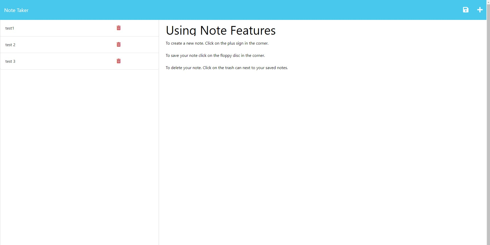

# <Express-Note-Taker>

## Description

This is a note taking application.  The user is able to add and remove note data from the application as the user needs.  In working on this application I was able to focus on further developing my back-end skill set, by working with Express.js, and working on developing api routes.

## Heroku Deployment Link
https://rocky-harbor-14327.herokuapp.com/

## Table of Contents

- [Installation](#installation)
- [Usage](#usage)
- [Credits](#credits)
- [License](#license)

## Installation

For installation the user will need to run the `npm -i` command from the terminal to install the necessary dependencies to run the application.  

## Usage

Once all dependencies have been downloaded the user will need to start the server.  This can be done by using the command `node server.js` and the user will then need to go navigate to `localhost:3001` and from there they are able to use the application.

The user is presented with a start button to click.

once they have clicked start they are able start a new note, or view previous notes stored.

## Credits

Starter Code Repo:
https://github.com/coding-boot-camp/miniature-eureka

Starter Code Contributors:
Xandromus:https://github.com/Xandromus

nol166:https://github.com/nol166

Georgeyoo:https://github.com/Georgeyoo

Crypto Documentation:
https://developer.mozilla.org/en-US/docs/Web/API/Crypto

body-parser Documentation:
https://expressjs.com/en/resources/middleware/body-parser.html

Heroku Documentation:
https://devcenter.heroku.com/articles/deploying-nodejs

## License

MIT License
